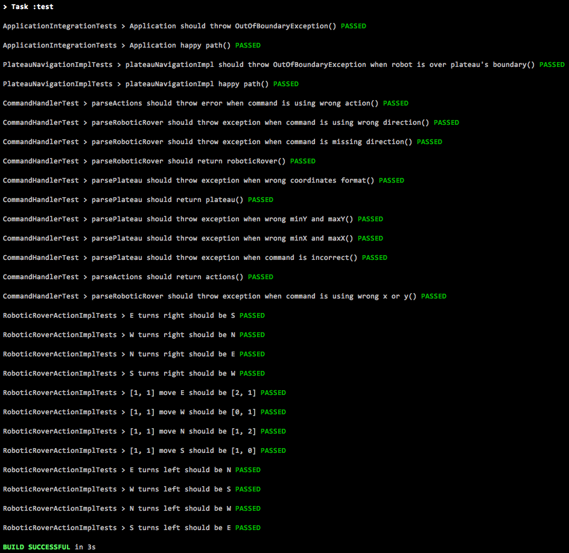

# Robotic Rover

## Problem definition
A squad of robotic rovers are to be landed by NASA on a plateau on Mars. This plateau, which is curiously rectangular, must be navigated by the rovers so that their on-board cameras can get a complete view of the surrounding terrain to send back to Earth...

See full requirement in [link](Mars%20rover.docx)

## Prerequisites
 - Kotlin 1.3
 - Java 8
 - Gradle 6.3

## Build
Main application [Application.kt](src/main/java/com/snooper/Application.kt)

```
$ gradle build
```

## Test
```
$ gradle test
```

### Unit tests [link](src/test/java/com/snooper/service)  
### Integration tests [link](src/test/java/com/snooper/ApplicationIntegrationTests.kt)



## Code Structure
In `src` folder
`Application` main function  
`/constant` enum types  
`/dto` models  
`/exception` exceptions  
`/service` logic implementation